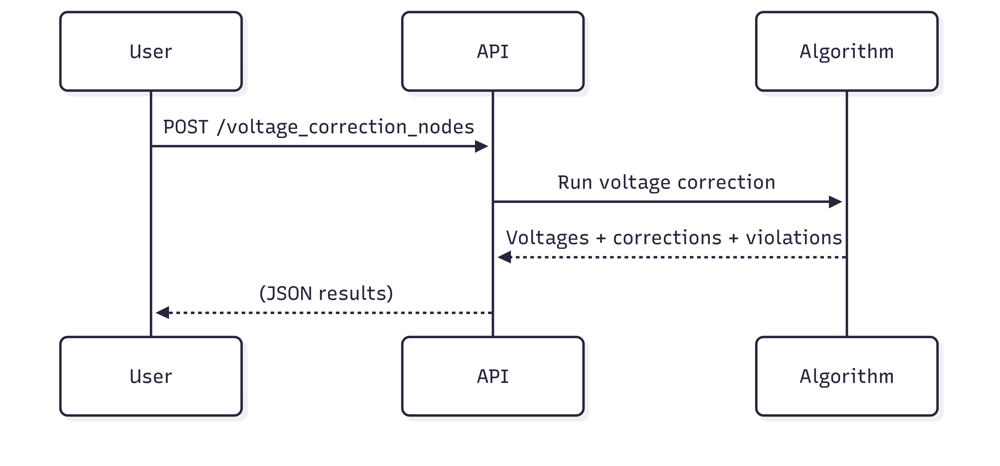

# ⚡ VoltTune: Voltage Correction Using Flexibility Allocation

VoltTune is a Python-based tool designed to identify and correct voltage violations in low-voltage or distribution electrical networks using a greedy optimization algorithm. It uses a sensitivity matrix estimated from historical measurements and leverages available flexibility (load reduction or injection) to bring all nodal voltages within a specified operating range.

---

## 📌 Features

- ✅ Learns network voltage sensitivities from historical data  
- ✅ Detects voltage violations based on user-defined voltage limits  
- ✅ Applies greedy voltage correction using available power flexibility  
- ✅ Supports real-world voltage/power data formats  
- ✅ Fully configurable via environment variables  
- ✅ Simple, modular, and readable code (PEP8-compliant)  

---

## ⚡ Workflow



---

## 📁 File Structure

```
VoltTune/
├── VoltTune.py               # Main script
├── README.md                 # Documentation
├── database/
│   └── historic_31.txt       # Example voltage/power history file
└── input/
    └── input.txt             # Example flexibility input file
```

---

## 📊 Input File Formats

### 1. `historic_31.txt` (Voltage & Power Time Series)
- Tab-separated values  
- Skips first 2 header lines  
- Alternating rows: `Voltage`, `Power`, `Voltage`, `Power`, ...  
- Each row: time series per node  

**Example (transposed for clarity):**

```
Node_0_V: 234.1    233.9    234.0    ...
Node_0_P:  5.3      5.5      5.4     ...
Node_1_V: 233.8    233.7    233.6    ...
Node_1_P:  3.1      3.2      3.3     ...
```

### 2. `input.txt` (Current Voltage and Flexibility per Node)
- Columns: `Voltage`, `LoadReductionFlex`, `PowerInjectionFlex`  
- Each row: one node  

**Example:**

```
230.5    1.5    -2.0
229.8    1.0    -1.2
```

> **Note:** Injection flexibility values must be negative in the file (they are internally negated to positive).

---

## ⚙️ How It Works

1. **Data Loading** — Reads voltage and power history and current flexibility  
2. **Sensitivity Estimation** — Computes sensitivity matrix `S` using least squares  
3. **Voltage Violation Detection** — Identifies nodes outside `Vmin`/`Vmax` bounds  
4. **Greedy Correction Loop** — Applies ∆P at most impactful nodes to fix voltages  

---

## ✅ Requirements

- Python 3.7+  
- NumPy  

Install with pip:

```
pip install numpy
```

---

## 🚀 Usage

### 1. Set Environment Variables

#### PowerShell (Windows):

```
$env:HISTORIC_FILE = "database/historic_31.txt"
$env:INPUT_FILE = "input/input.txt"
python VoltTune.py
```

#### Bash (Linux/macOS):

```
export HISTORIC_FILE="database/historic_31.txt"
export INPUT_FILE="input/input.txt"
python VoltTune.py
```

> ⚠️ If variables are not set, the script will exit with a warning.

---

## 📤 Output

After execution, you'll see:

- Applied ∆P per node  
- Corrected voltages  
- Number of remaining violations  

**Example Output:**

```
--- Final Results ---
Applied power corrections (Delta P per node):
[ 0.    0.    1.25  0.   -0.75  0.   ...]

Corrected voltages (in volts):
[230.0  229.8  230.5  228.9  229.2  ...]

Number of nodes still violating voltage limits: 0
```

---

## ⚠️ Troubleshooting

- **"Environment variables must be set"** → Set with `export` or `$env:`  
- **Dimension mismatch** → Files don't align in node count  
- **Too many iterations** → Flexibility may be insufficient  

---

## 📚 Customization

- Change `Vmin` and `Vmax` in `greedy_voltage_correction()`  
- Adjust reference node in `get_dv_dp()`  
- Modify prioritization logic in the correction loop  

---

## 🧠 Behind the Algorithm

VoltTune uses a **greedy heuristic**:  
- Select the worst voltage violation  
- Apply ∆P at node with highest impact  
- Recalculate and repeat until all voltages are valid or flexibility is exhausted  

This is fast and interpretable, though not globally optimal.

---

## 📜 License

---

## 🙌 Acknowledgements

Developed at INESC TEC as part of research into voltage control and DER integration.

---

## ✉️ Contact

**José P. Sousa**  
📧 jose.p.sousa@inesctec.pt  
🏢 INESC TEC